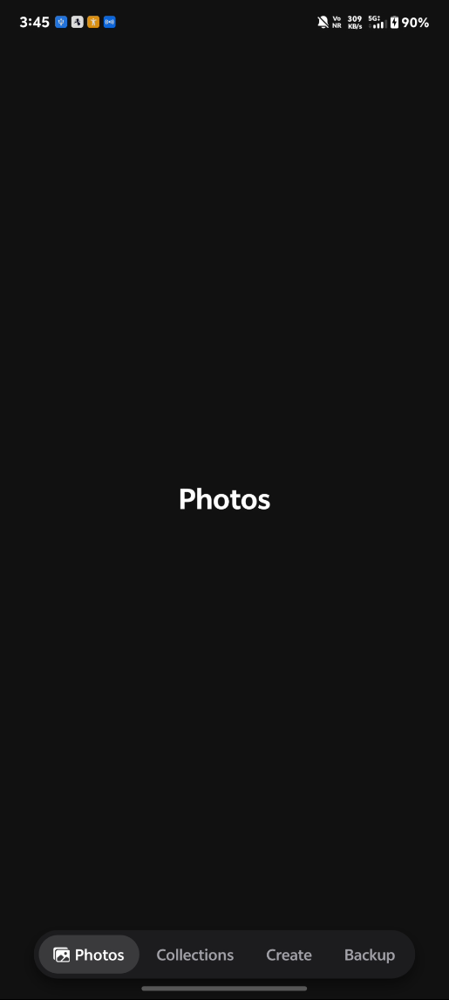

# NavBar — Reusable Pill-Shaped Tab Bar 💊

A plug-and-play **floating pill tab bar** for Expo + React Navigation projects.
Drop in the two files, wire up your tabs, and never write navbar code again.

---

## What it looks like



| State | Behaviour |
|---|---|
| **Focused tab** | Icon + label inside a highlighted inner pill |
| **Unfocused tab** | Label only, no background |
| **Pressed** | Subtle opacity fade (via `Pressable` style callback) |
| **Safe area** | Automatically clears the home indicator on all devices |

---

## Project structure

```
src/
├── app/
│   ├── _layout.tsx              # Expo Router root layout (Stack, headerShown: false)
│   └── App.tsx                  # Entry point — renders DynamicNavBar
├── components/
│   ├── CustomTabBar.tsx         # ← The reusable pill tab bar component
│   ├── PhotosScreen.tsx         # Placeholder screen — replace with your own
│   ├── CollectionsScreen.tsx    # Placeholder screen — replace with your own
│   ├── CreateScreen.tsx         # Placeholder screen — replace with your own
│   └── BackupScreen.tsx         # Placeholder screen — replace with your own
└── navigator/
    └── tabs/
        └── DynamicNavBar.tsx    # Bottom tab navigator wired to CustomTabBar
```

---

## Reusable files

| File | Purpose |
|---|---|
| `src/components/CustomTabBar.tsx` | **Must copy** — the visual pill bar, drop-in replacement for the default tab bar |
| `src/navigator/tabs/DynamicNavBar.tsx` | Reference navigator showing how to wire `CustomTabBar` into `@react-navigation/bottom-tabs` |
| `src/components/PhotosScreen.tsx` | Placeholder screen — swap with your real screen |
| `src/components/CollectionsScreen.tsx` | Placeholder screen — swap with your real screen |
| `src/components/CreateScreen.tsx` | Placeholder screen — swap with your real screen |
| `src/components/BackupScreen.tsx` | Placeholder screen — swap with your real screen |

> **To reuse just the navbar** in another project, you only need to copy `CustomTabBar.tsx`.
> The placeholder screen files and `DynamicNavBar.tsx` are there to show a working example.

---

## Dependencies

These packages must be present in the target project:

```bash
npx expo install @react-navigation/bottom-tabs @react-navigation/native react-native-safe-area-context @expo/vector-icons
```

| Package | Why |
|---|---|
| `@react-navigation/bottom-tabs` | Provides `createBottomTabNavigator` and `BottomTabBarProps` |
| `@react-navigation/native` | Peer dependency for React Navigation |
| `react-native-safe-area-context` | `useSafeAreaInsets()` — keeps the bar above the home indicator |
| `@expo/vector-icons` | `Ionicons` used for tab icons (swap for any icon set you prefer) |

---

## Usage — drop it into your project

### 1. Copy `CustomTabBar.tsx` into your `components/` folder

No changes needed inside the file.

### 2. Create your navigator

```tsx
// navigation/TabNavigator.tsx
import { createBottomTabNavigator } from '@react-navigation/bottom-tabs';
import { Ionicons } from '@expo/vector-icons';
import CustomTabBar from '@/components/CustomTabBar';

import HomeScreen from '@/screens/HomeScreen';
import ProfileScreen from '@/screens/ProfileScreen';

const Tab = createBottomTabNavigator();

export default function TabNavigator() {
  return (
    <Tab.Navigator
      tabBar={(props) => <CustomTabBar {...props} />}
      screenOptions={{ headerShown: false }}
    >
      <Tab.Screen
        name="Home"
        component={HomeScreen}
        options={{
          tabBarIcon: ({ color, size }) => (
            <Ionicons name="home" color={color} size={size} />
          ),
        }}
      />
      <Tab.Screen
        name="Profile"
        component={ProfileScreen}
        options={{
          tabBarIcon: ({ color, size }) => (
            <Ionicons name="person" color={color} size={size} />
          ),
        }}
      />
    </Tab.Navigator>
  );
}
```

### 3. Wrap your app in `NavigationContainer`

If you are **not** using Expo Router, wrap your root with `NavigationContainer`:

```tsx
import { NavigationContainer } from '@react-navigation/native';
import TabNavigator from '@/navigation/TabNavigator';

export default function App() {
  return (
    <NavigationContainer>
      <TabNavigator />
    </NavigationContainer>
  );
}
```

> **Using Expo Router?** `NavigationContainer` is handled automatically.
> Just render `<TabNavigator />` directly, as shown in `src/app/App.tsx`.

---

## Customisation

All visual tokens live in the `StyleSheet` at the bottom of `CustomTabBar.tsx`.

| Style key | What it controls | Default |
|---|---|---|
| `pill.backgroundColor` | Outer pill background | `#1C1C1E` (dark grey) |
| `pill.boxShadow` | Pill drop shadow | `0 6px 14px rgba(0,0,0,0.45)` |
| `tabActive.backgroundColor` | Focused tab inner pill | `#3A3A3C` |
| `tabPressed.opacity` | Press feedback opacity | `0.75` |
| `label.fontSize` | Tab label size | `14` |
| `labelActive.color` | Focused label colour | `#FFFFFF` |
| `labelInactive.color` | Unfocused label colour | `rgba(235,235,245,0.65)` |

### Handling screen content hidden behind the bar

Because the bar uses `position: 'absolute'`, screen content can scroll under it.
Fix this in each screen with the hook from React Navigation:

```tsx
import { useBottomTabBarHeight } from '@react-navigation/bottom-tabs';

function HomeScreen() {
  const tabBarHeight = useBottomTabBarHeight();
  return (
    <ScrollView contentContainerStyle={{ paddingBottom: tabBarHeight }}>
      {/* content */}
    </ScrollView>
  );
}
```

---

## Tech notes

- Uses **`Pressable`** (not the deprecated `TouchableOpacity`) with a `style` callback for press feedback
- Uses **`useSafeAreaInsets`** from `react-native-safe-area-context` (not the removed RN `SafeAreaView`)
- Shadow is a single CSS **`boxShadow`** string — no legacy `elevation` or `shadowColor` props
- Label resolution priority: `tabBarLabel` string → `title` → route name
- Fully typed via `BottomTabBarProps` from `@react-navigation/bottom-tabs`

---

## Running this project

```bash
# Install dependencies
npm install

# Start with Expo Go (no build needed)
npx expo start
```
